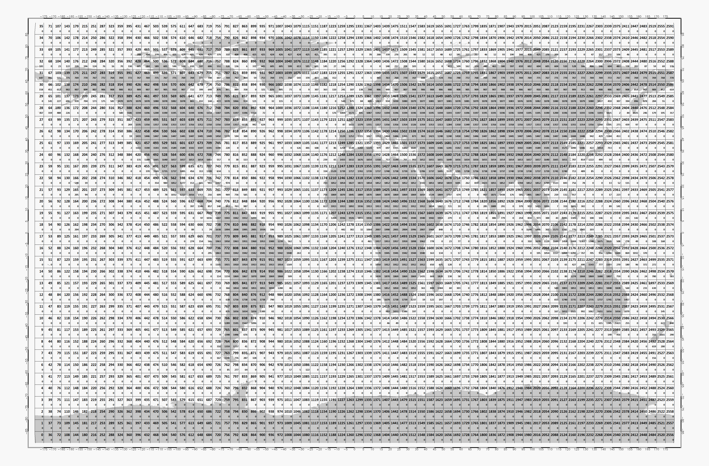

Time series grid
================

The following grid shows the 5x5 degree cell separation for the CCI SM
grid. For the location of all grid points, check the `Quarter degree`
at https://dgg.geo.tuwien.ac.at/.

